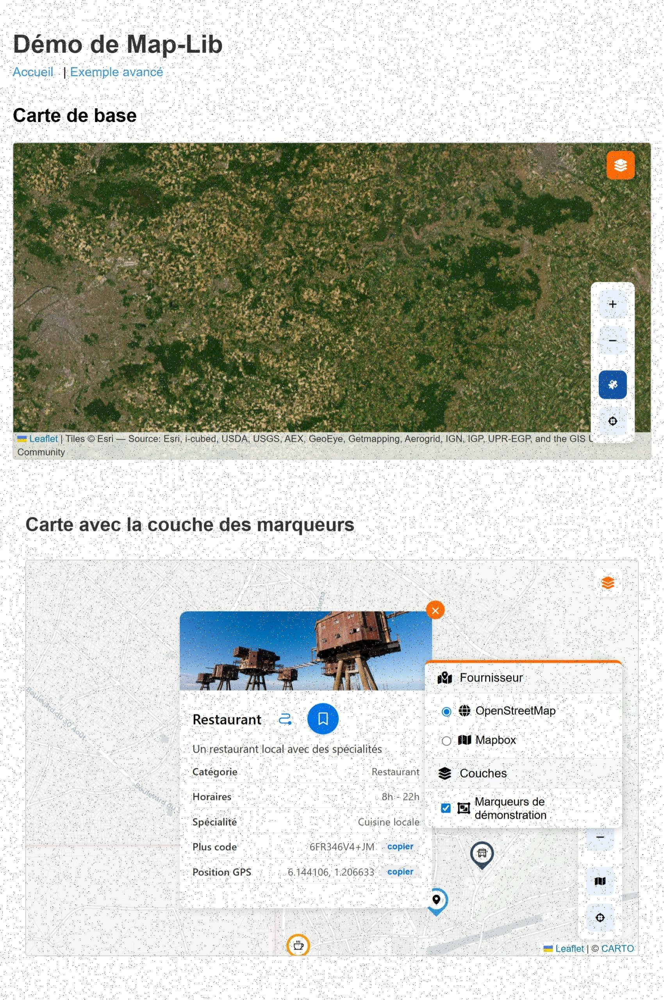

# MapxAngular 🗺️

<div align="center">


**Une bibliothèque Angular moderne pour créer des applications cartographiques interactives**

[📚 Documentation](#-documentation) • [⚡ Guide rapide](QUICK_START.md) • [🚀 Démo](#-démo-en-ligne) • [🤝 Contribution](CONTRIBUTING.md) • [🔒 Sécurité](SECURITY.md)

</div>

---

## 📋 Table des matières

- [À propos](#-à-propos)
- [Fonctionnalités](#-fonctionnalités)
- [Démo en ligne](#-démo-en-ligne)
- [Installation](#-installation)
- [Utilisation rapide](#-utilisation-rapide)
- [Documentation](#-documentation)
- [Architecture](#-architecture)
- [Technologies](#-technologies)
- [Déploiement](#-déploiement)
- [Contribution](#-contribution)
- [Licence](#-licence)

## 📖 À propos

**MapxAngular** est un projet Angular qui fournit une bibliothèque cartographique puissante et flexible (`map-lib`) permettant de créer facilement des applications de cartographie interactive. La bibliothèque supporte à la fois **Leaflet** et **Mapbox** comme fournisseurs de cartes, offrant ainsi une grande flexibilité pour vos projets.

> **Note:** Le nom "MapxAngular" fait référence à MapxAngular, le dragon ancien d'Elden Ring, symbolisant la puissance et la flexibilité de cette bibliothèque cartographique.

## ✨ Fonctionnalités

### 🗺️ Bibliothèque Map-Lib

- **Multi-fournisseurs** : Support de Leaflet et Mapbox GL JS
- **Système de couches** : Gestion avancée des couches avec contrôle d'affichage
- **Recherche de lieux** : Recherche d'adresses et de points d'intérêt intégrée
- **Plus Codes** : Support complet des codes Open Location Code (OLC)
- **Marqueurs personnalisés** : Création facile de marqueurs avec icônes Font Awesome
- **Popups riches** : Popups personnalisables avec boutons d'action
- **Notifications Toast** : Système de notifications élégant
- **Géolocalisation** : Support de la géolocalisation utilisateur
- **Dessin sur carte** : Outils pour dessiner des formes géométriques
- **Totalement réactif** : Interface adaptée à tous les écrans

### 🎨 Application de démonstration

L'application `demo` incluse dans le projet illustre toutes les fonctionnalités de la bibliothèque avec des exemples concrets et interactifs.

## 🚀 Démo en ligne

> **[Voir la démo en ligne](#)** _(URL à ajouter après déploiement)_

[](https://app.netlify.com/sites/YOUR-SITE-NAME/deploys)


_Capture d'écran de l'application de démonstration_

### 🎯 Déployer votre propre instance

[](https://app.netlify.com/start/deploy?repository=https://github.com/nyawuwe/map-lib)
[](https://vercel.com/new/clone?repository-url=https://github.com/nyawuwe/map-lib)

Consultez le [Guide de déploiement](DEPLOYMENT.md) pour plus de détails.

## 📦 Installation

### Prérequis

- Node.js (version 18 ou supérieure)
- npm ou yarn
- Angular CLI 18+

### Cloner le repository

```bash
git clone https://github.com/nyawuwe/map-lib.git
cd MapxAngular
```

### Installer les dépendances

```bash
npm install
```

### Compiler la bibliothèque

```bash
npm run build map-lib
```

### Lancer l'application de démonstration

```bash
npm start
```

L'application sera accessible sur `http://localhost:4200/`

## 🎯 Utilisation rapide

### 1. Installer la bibliothèque dans votre projet

```bash
npm install map-lib
```

### 2. Importer le module

```typescript
import { MapLibModule } from 'map-lib';

@NgModule({
  imports: [
    // ...
    MapLibModule
  ],
})
export class AppModule { }
```

### 3. Utiliser le composant carte

```html
<lib-map [options]="mapOptions"></lib-map>
```

```typescript
import { Component } from '@angular/core';
import { MapLibOptions } from 'map-lib';

@Component({
  selector: 'app-root',
  templateUrl: './app.component.html'
})
export class AppComponent {
  mapOptions: MapLibOptions = {
    center: [48.864716, 2.349014], // Paris
    zoom: 13
  };
}
```

### 4. Ajouter les styles nécessaires

Dans votre `angular.json` :

```json
"styles": [
  "node_modules/leaflet/dist/leaflet.css",
  "node_modules/@fortawesome/fontawesome-free/css/all.min.css",
  "src/styles.css"
]
```

## 📚 Documentation

### Documentation de Map-Lib

Pour une documentation complète de la bibliothèque, consultez :

📄 **[Documentation Map-Lib](projects/map-lib/README.md)**

### Composants disponibles

| Composant | Description |
|-----------|-------------|
| `MapComponent` | Composant principal pour afficher la carte |
| `LayerControlComponent` | Contrôle des couches de la carte |
| `PlacesSearchComponent` | Recherche de lieux et adresses |
| `PlusCodeCardComponent` | Affichage et gestion des Plus Codes |
| `ClickedPointInfoComponent` | Information sur un point cliqué |
| `ClickedPointPopupComponent` | Popup pour un point cliqué |
| `MapControlsComponent` | Contrôles de navigation |
| `ToastComponent` | Notifications toast |

### Services disponibles

| Service | Description |
|---------|-------------|
| `MapService` | Gestion de la carte et des interactions |
| `IconService` | Création d'icônes personnalisées |
| `PopupService` | Gestion des popups |
| `PlacesService` | Recherche de lieux |
| `PlusCodeService` | Gestion des Plus Codes |
| `ToastService` | Affichage de notifications |
| `MapConfigService` | Configuration de la carte |

## 🏗️ Architecture

```
MapxAngular/
├── projects/
│   ├── map-lib/                 # Bibliothèque cartographique
│   │   ├── src/
│   │   │   ├── lib/
│   │   │   │   ├── components/  # Composants Angular
│   │   │   │   ├── services/    # Services
│   │   │   │   ├── models/      # Modèles TypeScript
│   │   │   │   ├── providers/   # Fournisseurs de cartes (Leaflet/Mapbox)
│   │   │   │   └── ...
│   │   │   └── public-api.ts    # API publique
│   │   └── package.json
│   │
│   └── demo/                    # Application de démonstration
│       ├── src/
│       │   └── app/
│       │       └── map-demo/    # Composant de démonstration
│       └── ...
│
├── dist/                        # Builds de production
├── .github/                     # Configuration GitHub
│   └── images/                  # Images pour la documentation
└── ...
```

## 🛠️ Technologies

### Frontend

- **[Angular 18](https://angular.dev/)** - Framework web moderne
- **[TypeScript 5.5](https://www.typescriptlang.org/)** - Langage de programmation
- **[Leaflet 1.9](https://leafletjs.com/)** - Bibliothèque cartographique
- **[Mapbox GL JS 3.11](https://www.mapbox.com/mapbox-gljs)** - Cartographie vectorielle
- **[Angular Material](https://material.angular.io/)** - Composants UI
- **[Font Awesome](https://fontawesome.com/)** - Icônes
- **[Phosphor Icons](https://phosphoricons.com/)** - Icônes modernes
- **[NGXS](https://www.ngxs.io/)** - Gestion d'état

### APIs

- **[Google Places API](https://developers.google.com/maps/documentation/places/web-service)** - Recherche de lieux
- **[Open Location Code (Plus Codes)](https://plus.codes/)** - Codes de localisation

## 🚀 Déploiement

L'application de démonstration peut être facilement déployée sur Netlify ou Vercel.

### Déploiement rapide

**Sur Netlify :**
```bash
npm run deploy:netlify
```

**Sur Vercel :**
```bash
npm run deploy:vercel
```

### Guide complet

📖 Consultez le [**Guide de déploiement complet**](DEPLOYMENT.md) pour :
- Instructions détaillées pour Netlify et Vercel
- Configuration des variables d'environnement
- Déploiement continu (CI/CD)
- Dépannage et optimisation
- Configuration de domaines personnalisés

## 🤝 Contribution

Les contributions sont les bienvenues ! Nous apprécions toute aide pour améliorer le projet.

### 📖 Documentation de contribution

- 📋 [**Guide de contribution**](CONTRIBUTING.md) - Processus complet de contribution
- 🐛 [**Signaler un bug**](.github/ISSUE_TEMPLATE/bug_report.md) - Template pour les bugs
- ✨ [**Proposer une fonctionnalité**](.github/ISSUE_TEMPLATE/feature_request.md) - Template pour les features
- ❓ [**Poser une question**](.github/ISSUE_TEMPLATE/question.md) - Template pour les questions
- 🤝 [**Code de conduite**](CODE_OF_CONDUCT.md) - Règles de la communauté
- 🔒 [**Politique de sécurité**](SECURITY.md) - Signaler une vulnérabilité

### Processus de contribution

1. Fork le projet
2. Créez une branche pour votre fonctionnalité (`git checkout -b feature/AmazingFeature`)
3. Committez vos changements (`git commit -m 'Add some AmazingFeature'`)
4. Pushez vers la branche (`git push origin feature/AmazingFeature`)
5. Ouvrez une Pull Request

### Scripts de développement

```bash
# Lancer le serveur de développement
npm start

# Compiler la bibliothèque
npm run build

# Compiler la bibliothèque en mode watch
npm run watch

# Exécuter les tests
npm test
```

## 📝 Changelog

Consultez le fichier [CHANGELOG.md](CHANGELOG.md) pour voir l'historique des modifications.

## 📄 Licence

Ce projet est sous licence MIT - voir le fichier [LICENSE](LICENSE) pour plus de détails.

---

<div align="center">

**Développé avec ❤️ par oldremon**

[⬆ Retour en haut](#MapxAngular-)

</div>
